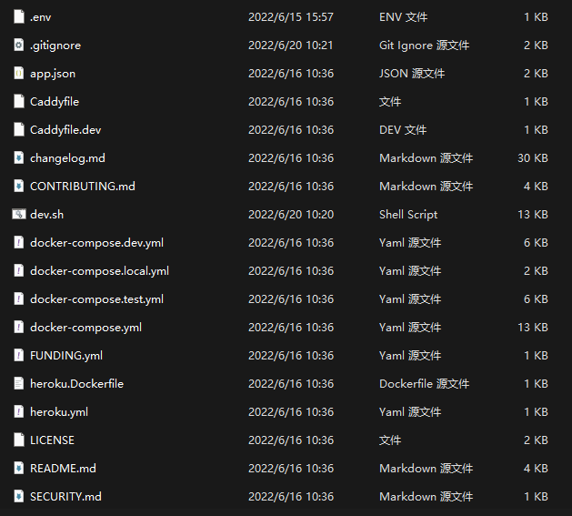
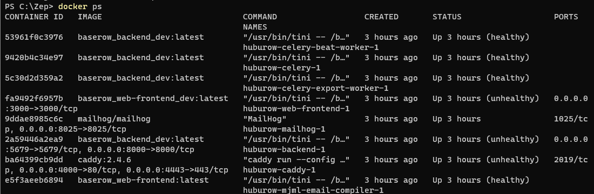
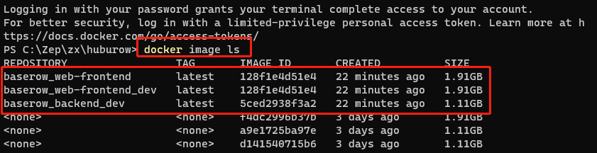
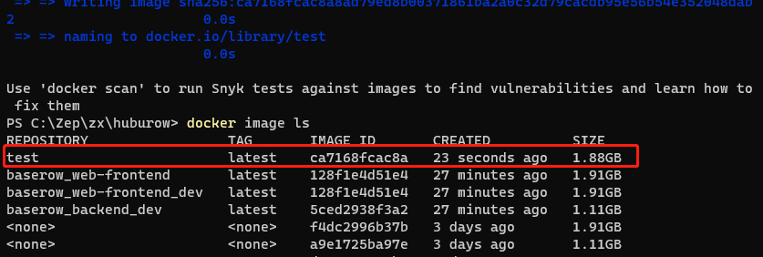
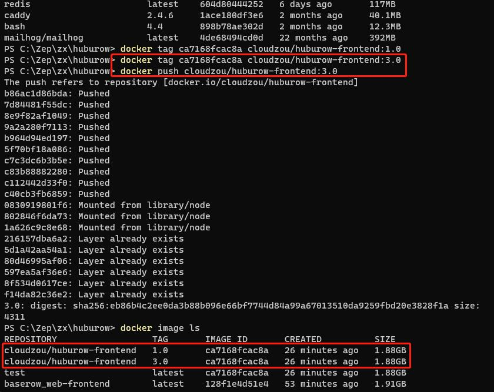

# Docker 入门(利用 docker 部署 web 应用)

## docker 常见命令

如上是 docker 项目的基础根目录

运行服务
`./dev.sh --build`

停止服务
`./dev.sh down`

查看当前所有进程
`docker ps`

使用 Compose 命令构建和运行应用

`docker-compose -f docker-compose.yml -f docker-compose.dev.yml up`

停止

`docker-compose -f docker-compose.yml -f docker-compose.dev.yml down`

使用 power shell 输入命令 `docker login` 登录 https://hub.docker.com/

登录成功后，就可以看到当前 docker 项目所有的镜像，输入命令 `docker image ls`

接着可以构建我们的应用，输入命令 `docker build -f .\web-frontend\Dockerfile -t test .`

指定到需要构建的项目（前端还是后端）的 `Dockerfile`，`test` 是镜像名称，`.` 指当前目录

再输入命令 `docker image ls` 查看所有镜像

此时会看到本地镜像会多出来一个`test`，接下来我们可以为这个本地镜像打上一个标签，相当于给他设定一个版本

输入命令 `docker tag ca7168fcac8a cloudzou/huburow-frontend:3.0`

`ca7168fcac8a` 是镜像 id，将此镜像标记为 tag:3.0 镜像，并推送

